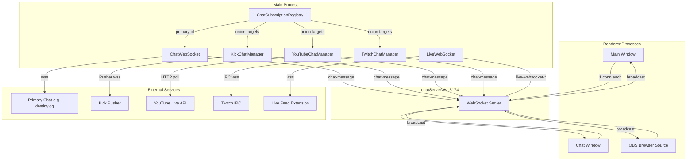
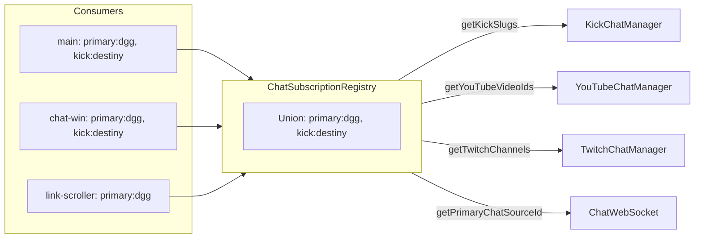
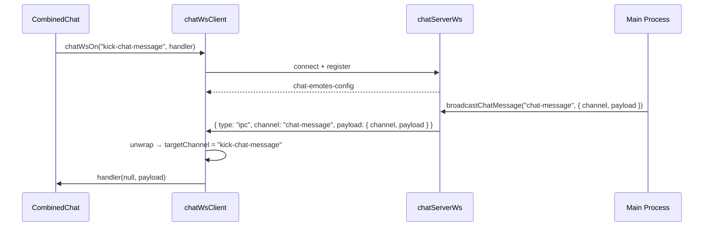
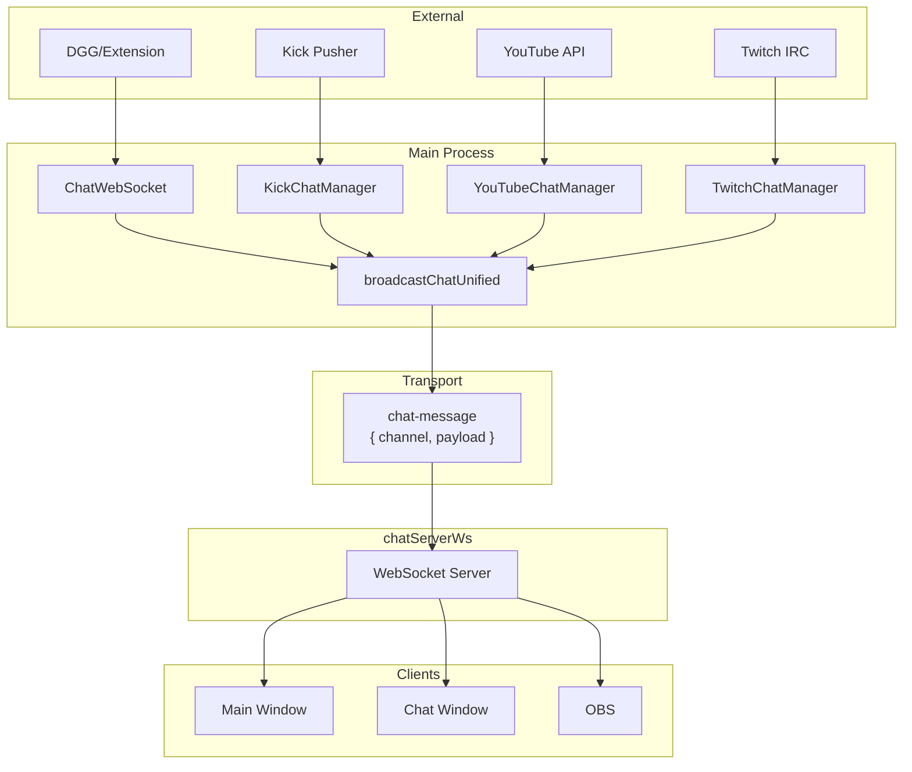

# WebSocket Architecture

This document describes the WebSocket flows in Omni Screen: how chat and live data move from external services through the main process to renderer windows and OBS.

## Overview

Omni Screen uses several WebSocket layers:

1. **Local chat server** (`chatServerWs`) – Single WebSocket server on `ws://127.0.0.1:5174`. All chat consumers (main window, chat window, OBS) connect here.
2. **Outbound connections** – Main process connects to external services (primary chat, Kick, Twitch, live feed).
3. **Unified delivery** – All chat messages flow through the `chat-message` channel with `{ channel, payload }`.

---

## High-Level Flow



---

## Chat Server (chatServerWs)

**File:** `electron/chatServerWs.ts`  
**URL:** `ws://127.0.0.1:5174`

The chat server is the single entry point for all chat delivery. It provides:

- **WebSocket server** – Renderer windows and OBS connect here.
- **HTTP proxy** – Emotes and flairs (`/emotes.json`, `/emotes.css`, `/emote/*`, `/flairs.json`, `/flairs.css`, `/flair/*`) to avoid CORS.
- **Ping/pong** – 30s interval for keepalive and disconnect detection.

### Client Registration

When a client connects, it sends a `register` message:

```json
{ "type": "register", "consumerId": "main", "embedChatKeys": ["primary:dgg", "kick:destiny", "youtube:abc123"], "opts": { "delayMultiplier": 1 } }
```

The server stores `consumerId` → socket, invokes the subscription callback to update `ChatSubscriptionRegistry`, and sends cached messages for the consumer's keys. Optional `opts.delayMultiplier` controls YouTube poll interval.

To unsubscribe without closing the connection, send `{ "type": "unregister", "consumerId": "main" }`. When a client disconnects (close/error), the server automatically unregisters that consumer so the main process stops fetching channels nobody is listening to.

### Message Format

All chat messages use the unified format:

```json
{ "type": "ipc", "channel": "chat-message", "payload": { "channel": "kick-chat-message", "payload": { ... } } }
```

The client unwraps `chat-message` and dispatches to handlers for the inner `channel`.

---

## Chat Subscription Registry

**File:** `electron/chatSubscriptionRegistry.ts`

The registry tracks which consumers want which chats and computes the union of targets.



**Embed key format:** `platform:id` (e.g. `kick:destiny`, `youtube:videoId`, `twitch:login`, `primary:dgg`).

**One connection per target** – If main window and chat window both want `kick:destiny`, there is a single Kick connection. Targets are driven by WebSocket `register` / `unregister` and socket disconnect; legacy `*-chat-set-targets` IPC handlers remain for backward compatibility.

---

## Outbound Chat Connections

### Primary Chat (ChatWebSocket)

**File:** `electron/chatWebSocket.ts`  
**Target:** Extension's `chatWssUrl` (e.g. `wss://chat.destiny.gg/ws`)

- Single instance in main process.
- Connect/disconnect driven by `ChatSubscriptionRegistry.getPrimaryChatSourceId()`.
- On connect, server sends `HISTORY`; renderer merges with existing messages (no full replace).
- Events: `connected`, `disconnected`, `history`, `message`, `broadcast`, `pin`, `me`, `names`, etc.
- All events go through `broadcastChatUnified` → `chat-message`.
- **Keepalive:** destiny.gg uses server-initiated pings; the client responds with pong. The client does not send pings.

### Kick (KickChatManager)

**File:** `electron/kickChatManager.ts`  
**Target:** Pusher `wss://ws-us2.pusher.com/...`

- Single instance; targets from registry union (`getKickSlugs`).
- Subscribes to `chatrooms.{chatroomId}` for each slug.
- History via HTTP fetch; live messages via Pusher events.
- Emits `kick-chat-message`, `kick-chat-message-deleted`, etc.

### YouTube (YouTubeChatManager)

**File:** `electron/youtubeChatManager.ts`  
**Target:** YouTube Live Chat API (HTTP polling)

- Single instance; targets from registry union (`getYouTubeVideoIds`).
- Uses continuation-based polling, not WebSocket.
- Emits `youtube-chat-message`.

### Twitch (TwitchChatManager)

**File:** `electron/twitchChatManager.ts`  
**Target:** `wss://irc-ws.chat.twitch.tv/`

- Single instance; targets from registry union (`getTwitchChannels`).
- IRC over WebSocket; JOIN channels, parse PRIVMSG.
- Emits `twitch-chat-message`, `twitch-chat-names`.

---

## Live WebSocket

**File:** `electron/liveWebSocket.ts`  
**Target:** Extension's `liveWssUrl`

Separate from chat. Used for:

- Live feed (embeds, banned list).
- Extension `onLiveMessage` handler processes messages.

Events: `live-websocket-connected`, `live-websocket-disconnected`, `live-websocket-message`, `live-websocket-embeds`, etc. These are broadcast directly (not through `chat-message`).

---

## Renderer Client (chatWsClient)

**File:** `src/utils/chatWsClient.ts`

Each renderer process has one WebSocket to `ws://127.0.0.1:5174`.



**API:**

- `chatWsOn(channel, handler)` – Subscribe; returns unsubscribe function.
- `chatWsSendRegister(consumerId, embedChatKeys, opts?)` – Register consumer; `opts.delayMultiplier` for YouTube poll interval.
- `chatWsSendUnregister(consumerId)` – Unregister without closing the connection.
- `chatWsOff(channel, handler)` – Remove handler.

**Reconnect:** If connection drops and handlers exist, client reconnects after 3s.

---

## Message Flow Summary



---

## Key Files

| File | Role |
|------|------|
| `electron/chatServerWs.ts` | Local WebSocket server + HTTP proxy for emotes/flairs |
| `electron/chatWebSocket.ts` | Primary chat outbound WebSocket |
| `electron/liveWebSocket.ts` | Live feed outbound WebSocket |
| `electron/chatSubscriptionRegistry.ts` | Consumer registry, union targets |
| `electron/kickChatManager.ts` | Kick chat (Pusher + HTTP history) |
| `electron/youtubeChatManager.ts` | YouTube chat (HTTP polling) |
| `electron/twitchChatManager.ts` | Twitch chat (IRC over WebSocket) |
| `src/utils/chatWsClient.ts` | Renderer WebSocket client |
